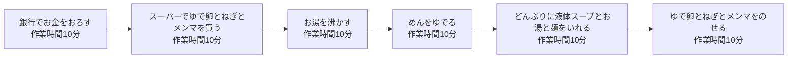

```mermaid
flowchart LR
a["銀行でお金をおろす
作業時間10分"]
b["スーパーでゆで卵とねぎとメンマを買う
作業時間10分"]
c["お湯を沸かす
作業時間10分"]
d["めんをゆでる
作業時間10分"]
e["どんぶりに液体スープとお湯と麺をいれる
作業時間10分"]
f["ゆで卵とねぎとメンマをのせる
作業時間10分"]
a-->b
b-->c
c-->d
d-->e
e-->f
```