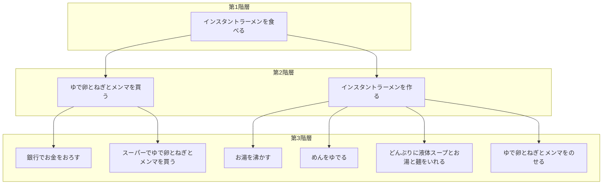

```mermaid
flowchart TB
subgraph "第1階層"
    a["インスタントラーメンを食べる"]
end
subgraph "第2階層"
    b["ゆで卵とねぎとメンマを買う"]
    e["インスタントラーメンを作る"]
end
subgraph "第3階層"
    c["銀行でお金をおろす"]
    d["スーパーでゆで卵とねぎとメンマを買う"]
    f["お湯を沸かす"]
    g["めんをゆでる"]
    j["どんぶりに液体スープとお湯と麺をいれる"]
    k["ゆで卵とねぎとメンマをのせる"]
end
a-->b
a-->e
b-->c
b-->d
e-->f
e-->g
e-->j
e-->k
```