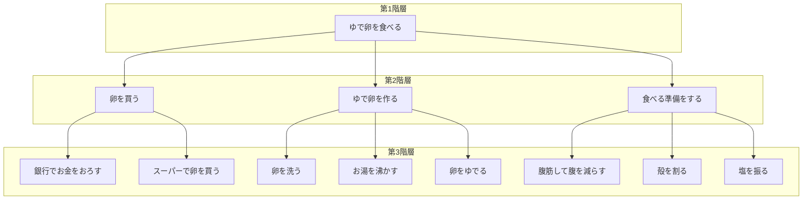

```mermaid
flowchart TB
subgraph "第1階層"
    a["ゆで卵を食べる"]
end
subgraph "第2階層"
    b["卵を買う"]
    c["ゆで卵を作る"]
    d["食べる準備をする"]
end
subgraph "第3階層"
    e["銀行でお金をおろす"]
    f["スーパーで卵を買う"]
    g["卵を洗う"];
    h["お湯を沸かす"]
    i["卵をゆでる"]
    j["腹筋して腹を減らす"]
    k["殻を割る"]
    l["塩を振る"] 
end
    a-->b;
    a-->c;
    a-->d;
    b-->e;
    b-->f;
    c-->g;
    c-->h;
    c-->i;
    d-->j;
    d-->k;
    d-->l;
```